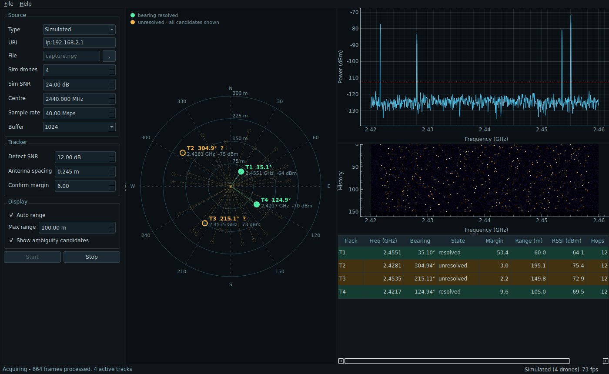

# Multi-Drone SDR Tracker

Direction finding for frequency-hopping drones from four coherent receive
channels (2× AD9361, e.g. an FMCOMMS5), with a PyQt6 desktop application.



This is independent of the UAV atlas pipeline in `app/`, `agents/` and
`crawlers/` — it processes live IQ, not crawled records, and shares nothing
but the repository.

## The problem this solves

The N–S and E–W antenna pairs sit about **two wavelengths** apart at
2.44 GHz. That buys angular resolution, but it puts the array far past the
λ/2 spacing at which a phase interferometer is unambiguous. A single
snapshot's measured phase is consistent with roughly a dozen different
bearings, and the aliases are *exact* — they agree with the measurement on
every one of the array's six baselines at once. Beamforming the full array
with one incident signal produces **seven peaks of identical height**. No
amount of processing recovers the true bearing from one hop.

What breaks the tie is a second measurement at a different scale, and a
frequency-hopping emitter supplies exactly that for free: each hop has its
own wavelength, so each hop's aliases move while the true direction stays
put. The tracker accumulates hops per track and scores every candidate
direction against all of them, reporting a bearing as resolved only once
one direction clearly out-fits every distinct alternative.

**The hopping is not an obstacle here. It is the thing that makes the
measurement possible.**

## Measured performance

200 random bearings per condition, 5-hop tracks:

| Condition | Bearing within 5° | Reported resolved | Confidently wrong |
| --- | ---: | ---: | ---: |
| 30 dB SNR, hops spread over band | 100 % | 99 % | **0 %** |
| 20 dB SNR, hops spread over band | 99.5 % | 83 % | **0 %** |
| 10 dB SNR, hops spread over band | 87.5 % | 4 % | **0 %** |
| Any SNR, all hops on one carrier | 12 % | **0 %** | **0 %** |

The last row is the important one. Hops that share a carrier carry no
direction information, and the tracker reports them as unresolved rather
than asserting a confident wrong bearing — the worst possible failure for
counter-UAV work.

`ambiguity_margin` is the ratio by which the winning direction out-fits the
best distinct alternative. Calibrated over 4320 trials: below 2 it is
6–16 % correct, 2–3 is 84 %, above 30 is 99.4 %. The default confirm
threshold of 6 keeps about 98 % of confirmations correct.

## Running the application

```bash
pip install -e '.[gui]'

python -m sdr.gui.app                          # simulated drones, starts immediately
python -m sdr.gui.app --drones 4 --no-autostart
python -m sdr.gui.app --source fmcomms5 --uri ip:192.168.2.1
python -m sdr.gui.app --file capture.npy       # replay a recording
```

Installed as a package it is also on the path as `uav-sdr-tracker`.

| View | Shows |
| --- | --- |
| **PPI scope** | Bearing and range per track. Resolved tracks are solid with a trail; unresolved ones are drawn with *every* candidate bearing their phase permits, so the display never implies certainty it does not have. |
| **Spectrum** | Combined 4-channel power with the adaptive detection threshold. |
| **Waterfall** | Rolling history — a hopping emitter reads as scattered dashes, not a line. |
| **Track table** | Frequency, bearing, state, margin, range, RSSI and hop count per track. `File ▸ Export detections to CSV` writes the full log. |

Detection SNR, antenna spacing and confirm margin apply live while
acquiring; source settings are locked during capture.

## Using it as a library

```python
from sdr.multi_drone_tracker import MultiDroneSDRTracker
from sdr.sources import SimulatedSource, SimulatedDrone

source = SimulatedSource(drones=[SimulatedDrone(bearing_deg=60.0, range_m=120.0)])
tracker = MultiDroneSDRTracker(sampling_rate=40e6, center_freq_hz=2.44e9)

for _ in range(10):
    for det in tracker.process_sdr_buffer(source.read()):
        if not det.bearing_ambiguous:
            print(f"T{det.track_id}: {det.bearing_degrees:.1f}° at {det.distance_meters:.0f} m")
```

`process_frame()` returns the same detections plus the spectrum, for
display without recomputing the FFT.

`SimulatedSource` derives each drone's transmit amplitude from its stated
range through the same log-distance model the tracker inverts, so simulated
truth round-trips: give it a drone at 105 m and the tracker reports 105 m.

## Before trusting it on real hardware

Three things the synthetic validation cannot cover:

1. **Phase-calibrate the receiver.** Inject one common reference into all
   four inputs, record the per-channel phase offsets, and pass them as
   `phase_correction_rad` to `FMComms5Source`. Cable and filter mismatch
   otherwise adds a fixed bias to every bearing.
2. **Calibrate the range model.** `rssi_at_1m_dbm` and
   `path_loss_exponent` are transmitter-specific. Derive them against a
   real reference emitter. Log-distance ranging stays rough regardless —
   multipath and unknown transmit power dominate.
3. **Check the antenna mapping.** Channels are 0 = North, 1 = East,
   2 = South, 3 = West. Getting this wrong rotates or mirrors every
   bearing, consistently and silently.

The simulation models a clean plane wave with perfectly matched channels,
no mutual coupling and no multipath. It validates the signal processing,
not the RF front end.

## A hardware option worth considering

Adding one antenna pair at **≤ λ/2 spacing** (~6.1 cm at 2.44 GHz) makes
every individual hop unambiguous on its own, removing the dependence on hop
diversity entirely. The short pair gives a coarse but unique bearing; the
existing wide pair refines it. Classic coarse–fine interferometry.

For one drone this is unnecessary — the hop-based method already gets there
for free. It earns its cost when tracking several simultaneous hoppers,
where correctly associating hops to emitters becomes the limiting factor.
Merely perturbing the existing array off its square lattice was tested and
is *not* sufficient: it cuts seven aliases to two, but only suppresses the
survivors to 0.99 relative height, which noise swallows.

## Tests

```bash
pytest tests/test_sdr_tracker.py tests/test_sdr_app.py -q
```

26 tests. GUI tests run on Qt's offscreen platform and need no display;
they skip automatically when PyQt6 is absent. The live-hardware path is
the one thing not covered.
